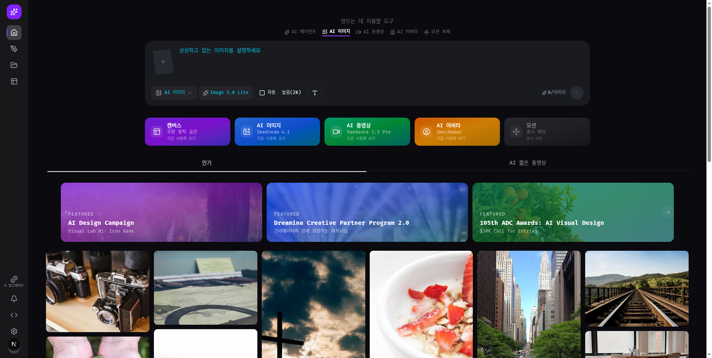

# Dreamina AI UI Clone

Pixel-perfect UI clone of [Dreamina by CapCut](https://dreamina.capcut.com/ai-tool/home?type=image) — ByteDance's AI image generation tool.

Built with Next.js, Tailwind CSS v4, shadcn/ui, and Vercel AI Elements.



## Features

- Prompt bar with image upload (tilted stacked cards with expand-on-hover animation)
- Model/ratio/quality selectors matching Dreamina's Lark Design system
- Tool tabs (Canvas, AI Image, AI Video, AI Avatar, Motion)
- Gallery grid with featured cards

## Getting Started

```bash
pnpm install
pnpm dev
```

Open [http://localhost:3000](http://localhost:3000).
